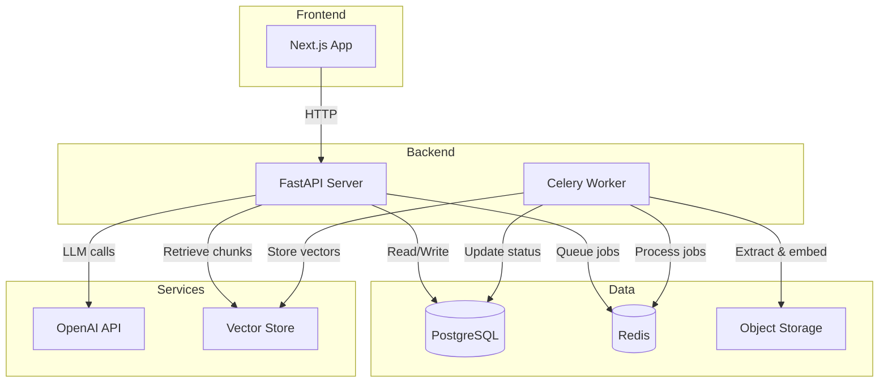

## Project: Flashcard Learning Assistant (Optional RAG, Structured JSON, Swipe UI)

### Goals
- Build a learning assistant that generates swipeable flashcards for a user-specified topic.
- Support optional RAG: if users upload PDF resources, generate content grounded in those resources; otherwise generate from general knowledge.
- Enforce strict, machine-validated JSON output (schema-first) so the UI is deterministic and reliable.
- Provide gated example generation per concept via `example_possible`.
- Deploy to a custom domain with a production-grade API and UI.
- Protect user data with clear retention, deletion, and access controls.

### Non-goals (for MVP)
- Full spaced repetition algorithm (Anki-level scheduling).
- Multi-language output.
- Collaborative workspaces and sharing.
- Offline mode.
- Advanced OCR-first ingestion for all PDFs (OCR will be a fallback, not default).

---

## Guiding Principles
- Schema-first and versioned outputs (server validates before persist/return).
- Transparent provenance (show sources and metrics when RAG is used).
- Cost-aware by default (estimates, caps, and quotas).
- Privacy-by-design (least privilege, deletion path, minimal logging of content).
- Degrade gracefully (fallbacks when RAG/LLM fail).

---

## High-level Architecture

### Components
1. **Frontend**: Next.js 16 + React 19 + Tailwind CSS (v4); optional shadcn/ui; Swiper or custom nav
   - Flashcard swipe deck view
   - Progressive disclosure (2 bullets shown, reveal remaining 3)
   - "Show example" button only when `example_possible=true`
   - Upload resources page and status

2. **Backend API**: FastAPI
   - Authentication (MVP can start with anonymous sessions, then add auth)
   - Deck generation endpoint
   - Example generation endpoint
   - Resource upload and ingestion status endpoints
   - Estimate endpoint for tokens and cost

3. **Ingestion Worker**: Celery or RQ (with Redis)
   - PDF text extraction
   - Chunking
   - Embedding
   - Vector store upsert

4. **Datastores**
   - Postgres: users, workspaces, resources, decks, cards, cost stats, metrics
   - Object storage: PDF files
   - Vector store: Chroma/FAISS (local) or pgvector (production)

5. **LLM**: LangChain + langchain-openai for LLM abstraction
   - Enables easy provider switching (OpenAI, Anthropic, local models)
   - Structured output via Pydantic models with `with_structured_output()`
   - LangSmith tracing for debugging (optional)
   - Separate chains for deck generation and example generation

---

## Core User Flows

### Flow A: No resources (non-RAG)
1. User enters a topic and selects difficulty.
2. UI calls `/v1/deck/estimate` to show cost/time (optional UI step).
3. UI calls `/v1/deck/generate`.
4. API generates deck JSON, validates against schema, persists, returns deck.
5. User swipes cards.
6. User taps "Show example" on cards where allowed.
7. UI calls `/v1/card/{id}/example`, caches result, renders example.

### Flow B: With resources (RAG)
1. User uploads one or more PDFs to a workspace.
2. API stores files, enqueues ingestion jobs.
3. Ingestion extracts, chunks, embeds, stores vectors with page metadata.
4. User requests deck generation for a topic within that workspace.
5. API retrieves relevant chunks, injects as context, generates deck.
6. Deck includes sources and RAG metrics (chunks used, relevance, pages).

---

## Output Contracts (Schema-first)

### Deck Response (conceptual)
- `schema_version`
- `deck_id`
- `topic`
- `scope` (optional; chosen subtopic)
- `difficulty_level`
- `concepts[]` (3-7 items)
  - `card_id`
  - `title`
  - `bullets[]` (exactly 5 strings)
  - `example_possible` (boolean)
  - `example_hint` (optional)
  - `source_refs[]` (optional; only when RAG is used)
- `sources[]` (optional in non-RAG, recommended in RAG)
- `generation_metadata` (model, prompt_version, tokens, timestamp, rag_used, retrieval_metrics?)

### Example Response (conceptual)
- `schema_version`
- `card_id`
- `example` (string or structured sections)
- Optional: `steps[]`, `pitfalls[]`
- `source_refs[]` (optional; only when RAG is used)
- `generation_metadata` (model, prompt_version, tokens, timestamp)

All LLM outputs must validate server-side before returning to clients. If invalid, attempt a single repair pass with validation errors and schema included; otherwise return a clear error.

---

## Prompting Strategy

### Prompt Registry
Maintain versioned prompt templates:
- `DECK_SYSTEM_PROMPT_vX`
- `DECK_USER_PROMPT_vX`
- `RAG_CONTEXT_TEMPLATE_vX`
- `EXAMPLE_SYSTEM_PROMPT_vX`
- `EXAMPLE_USER_PROMPT_vX`

Store in: `backend/app/prompts/registry.py`

### Baseline Sampling Settings
- Deck generation: `temperature=0.3`, `top_p=1.0` (consistency)
- Example generation: `temperature=0.7`, `top_p=1.0` (variety)
- Regenerate card/example: slightly higher temperature if needed

### Edge Case: Overly broad topics
If the topic is too broad (example: "Physics"):
- Run a scope-narrowing call to propose 3-5 subtopics.
- Require the user to select one subtopic before generating the deck.
- Persist the chosen scope in the deck metadata.

### Validation and Repair
- Validate JSON strictly against schema.
- If invalid, run a single "repair" call using the schema and validation errors.
- If still invalid, return an error and log the invalid payload for analysis.

### RAG Safety
- Treat retrieved text as untrusted data; do not follow instructions found in sources.
- Delimit and label source excerpts clearly in the prompt.
- Prefer answers grounded in sources when RAG is used, but allow "insufficient information" responses when needed.

---

## Reliability, Safety, and Cost Controls

### Error Handling
- Retries with exponential backoff for transient LLM failures (429, 5xx).
- Timeouts for vector retrieval and ingestion steps.
- Graceful degradation: if RAG retrieval times out, fall back to non-RAG generation and record `rag_used=false` plus a warning.
- Error responses follow `docs/ERRORS.md` with a top-level `error` object and `request_id` for correlation.

### Circuit Breaker
- If OpenAI calls fail repeatedly within a rolling window:
  - Open circuit for 30-60 seconds
  - Return a clear error and do not attempt further calls until reset
  - Prevents cost spikes and cascading failures

### Token and Cost Management
- Implement token counting prior to calls.
- Add `/deck/estimate` endpoint.
- Record per deck:
  - `tokens_used`
  - `api_cost_cents`
  - `generation_time_ms`

### Security and Privacy
- Validate file types with magic bytes, enforce size limits, and scan for obvious corruption.
- Per-workspace access control for resources and decks.
- Data retention policy with delete endpoints for decks and resources.
- Encryption in transit; encryption at rest where available.

### Quotas and Limits (defaults)
- Free tier: 10 decks/day, 30 requests/hour/user
- Hard caps:
  - 7 concepts per deck (schema cap)
  - 10k token cap per deck generation request
  - 2k token cap per example request
  - PDF upload: 25MB per file (configurable)
  - Workspace: max 10 PDFs (configurable)

---

## Project Structure

### Backend
```
backend/
  app/
    main.py
    api/
      routes_health.py
      v1/
        __init__.py
        routes_deck.py
        routes_card.py
        routes_resources.py
        routes_health.py
    services/
      llm_client.py
      deck_generator.py
      example_generator.py
      rag_retriever.py
      token_estimator.py
      cost_calculator.py
    prompts/
      registry.py
    db/
      models.py
      session.py
      migrations/
    workers/
      ingestion_jobs.py
      chunking.py
      pdf_extract.py
      embeddings.py
    schemas/
      deck.py
      example.py
      resources.py
    middleware/
      rate_limit.py
      request_id.py
      auth.py
    utils/
      logging.py
      timeouts.py
      exceptions.py
    tests/
      unit/
      integration/
      evals/
  Dockerfile
  pyproject.toml
```

### Frontend
```
frontend/
  src/
    app/
      layout.tsx
      page.tsx
      globals.css
      deck/[deckId]/page.tsx
      workspace/[workspaceId]/resources/page.tsx
    components/
      flashcards/
        DeckSwiper.tsx
        Flashcard.tsx
        ExamplePanel.tsx
      ui/
    lib/
      api.ts
      queryClient.ts
      shortcuts.ts
  __tests__/
  Dockerfile
  next.config.ts
```

---

## API Design (MVP)

### Resources
- `POST /v1/resources/upload`
  - multipart upload
  - body: `workspace_id`, `file`
  - returns: `resource_id`, `status`

- `GET /v1/resources/{resource_id}/status`
  - returns: `status` (UPLOADED, PROCESSING, READY, FAILED), `error?`

- `GET /v1/resources`
  - input: `workspace_id`
  - returns: list with `resource_id`, `filename`, `status`, `created_at`

- `DELETE /v1/resources/{resource_id}`
  - removes file and vectors, marks resource deleted

### Deck
- `POST /v1/deck/estimate`
  - input: `{ topic, workspace_id?, difficulty_level, max_concepts? }`
  - output: `{ estimated_tokens, estimated_cost_usd, estimated_seconds }`

- `POST /v1/deck/generate`
  - input: `{ topic, workspace_id?, difficulty_level, max_concepts?, scope? }`
  - output: `DeckResponse`

- `GET /v1/deck/{deck_id}`
  - output: `DeckResponse` persisted

### Card
- `POST /v1/card/{card_id}/example`
  - input: `{ style?, length?, constraints? }`
  - output: `ExampleResponse`

### Health
- `GET /health` (root health for Docker/infra)
- `GET /v1/health` (versioned API health)
  - output: `{ status: "ok" }`

---

## RAG Pipeline (PDF Ingestion)

### Ingestion Steps
1. Validate file type and size.
2. Compute file hash and dedupe if already ingested.
3. Store in object storage, create `Resource` record.
4. Enqueue ingestion job.
5. Extract text:
   - Prefer direct text extraction
   - If extraction is poor, optionally fall back to OCR (later enhancement)
   - Record extraction quality score for debugging
6. Chunk text:
   - Token-aware chunking (example: 800 tokens, 15% overlap)
   - Preserve page metadata when possible
7. Embed chunks.
8. Upsert into vector store with metadata:
   - resource_id
   - page number or page range
   - chunk_id
9. Mark resource as READY.

### Retrieval at Generation Time
- Retrieve top-k chunks by similarity to topic.
- Optionally apply MMR diversification.
- Enforce a similarity threshold; if too low, mark `rag_used=false`.
- Return context and metrics:
  - chunks retrieved
  - avg similarity
  - distinct pages used

---

## UX and Frontend State Management

### Server State and Caching
Use TanStack Query:
- Cache deck for 5 minutes
- Cache examples per card for 24 hours (configurable)
- Retries enabled for idempotent GETs
- Mutations update cache on success

### Loading and Error UX
- Skeleton placeholders for deck and example sections.
- Error boundaries with "Retry" action.
- Display RAG status:
  - "Processing resources" while ingestion runs
  - RAG transparency indicator after generation

### Flashcard UX Enhancements (post-MVP)
- Progressive disclosure (2 bullets, show more)
- Keyboard shortcuts:
  - Arrow keys: navigate
  - E: show example
  - R: regenerate
- Optional "Regenerate card" action with a cost warning
- Deck library view with saved decks and last studied time
- Basic progress tracking (cards viewed, examples opened)

---

## Testing and Quality Assurance

### Unit Tests
- Schema compliance:
  - concepts count between 3 and 7
  - exactly 5 bullets each
  - required fields present
- Schema versioning and migration guards
- Token estimation and cost calculator correctness
- Retry logic behavior on simulated 429

### Integration Tests
- Upload PDF, ingest, generate deck with sources
- RAG timeout triggers fallback
- Corrupted PDF handled gracefully
- Prompt-injection attempt in PDF is ignored by model

### LLM Evals (automated)
- Create a small gold set:
  - 10 topics, fixed difficulty
- Score:
  - bullet progression quality
  - factuality (basic checks)
  - example usefulness
- Run nightly or on demand

### Load Testing
- Simulate 100 concurrent deck generations:
  - Ensure rate limiting
  - Ensure circuit breaker behavior
  - Validate latencies and error rates

---

## Deployment Plan (Domain Hosting)

### Target: Single EC2 Host (initial)
- Docker Compose services:
  - frontend
  - backend
  - postgres
  - redis
  - worker
  - nginx reverse proxy

### Domains
- `yourdomain.com` -> frontend
- `api.yourdomain.com` -> backend

### CI/CD
- Build and test on push
- Deploy on main branch:
  - Pull new images
  - Run migrations
  - Restart services

### Observability
- Structured logs with request IDs
- Basic metrics:
  - LLM call count
  - token usage
  - failures by type
  - average latency
- Optional: LangSmith tracing (later)
- Backups for Postgres and object storage with retention policy

### Rollback Strategy
- **Pre-deployment**:
  - Tag current working image before deploying new version
  - Take database snapshot before migrations
- **Automated rollback triggers**:
  - Health check failures for 3+ consecutive minutes
  - Error rate exceeds 10% over 5 minutes
  - P95 latency exceeds 10 seconds
- **Manual rollback procedure**:
  1. Stop new containers: `docker compose down`
  2. Revert to tagged image: `docker compose up -d --no-deps <service>:<previous-tag>`
  3. If DB migration failed: restore from snapshot
  4. Verify health endpoint and run smoke tests
- **Post-mortem**: Document root cause and update deployment checklist

### Monitoring and Alerting
- **Metrics to track**:
  - Request latency (P50, P95, P99)
  - Error rates by endpoint and error code
  - LLM token usage and cost per hour/day
  - Circuit breaker state changes
  - Queue depth and worker throughput
  - Database connection pool utilization
- **Alert thresholds**:
  | Metric | Warning | Critical |
  |--------|---------|----------|
  | Error rate | > 5% | > 10% |
  | P95 latency | > 5s | > 10s |
  | Circuit breaker opens | Any | 3+ in 1 hour |
  | Daily token spend | > 80% budget | > 95% budget |
- **On-call escalation**:
  - Slack/PagerDuty integration for critical alerts
  - Runbook links embedded in alert messages

---

## Component Dependency Diagram



---

## Detailed Phases and Step-by-Step Execution

## Phase 0: Product Spec and Contracts
### Deliverables
- JSON schema v1 with examples and `schema_version`
- Error code catalog
- Data retention and deletion policy
- RAG safety checklist (prompt injection handling)

### Steps
1. Finalize deck/example schemas, include IDs and versioning.
2. Document error codes and retry behavior.
3. Define retention windows and delete flows (decks/resources).
4. Review RAG safety and quality criteria.

Exit criteria:
- Schema and contracts reviewed, sample payloads validate.

---

## Phase 1: Repo Setup and Foundations
### Deliverables
- Monorepo or two repos (backend, frontend)
- Basic Docker setup
- Environment configuration template

### Steps
1. Create `backend/` and `frontend/` projects.
2. Add Dockerfiles and a Compose file.
3. Add .env.example with all required variables.
4. Implement `/health` in FastAPI.
5. Implement basic Next.js homepage with a topic input.

Exit criteria:
- `docker compose up` runs successfully and `/health` returns ok.

---

## Phase 2: Schema-first Deck Generation (No RAG)
### Deliverables
- Pydantic schemas
- `/deck/generate` endpoint
- Persist deck and cards
- Deck UI with swiping

### Steps
1. Implement Pydantic models for deck and example.
2. Implement OpenAI call with Structured Outputs using the JSON schema.
3. Validate output server-side, persist to Postgres.
4. Implement `GET /deck/{deck_id}`.
5. Build flashcard swiper UI showing title and bullets.

Exit criteria:
- For test topics, deck validates every time and renders in UI reliably.

---

## Phase 3: Example Generation (Gated)
### Deliverables
- `/card/{id}/example` endpoint
- UI "Show example" gating
- Example caching

### Steps
1. Add `example_possible` to schema and ensure it is set correctly by prompt rules.
2. Implement example generation with higher temperature baseline.
3. Save example to DB and return.
4. UI:
   - Render button only if true
   - Show skeleton while loading
   - Cache result in TanStack Query

Exit criteria:
- Examples generate only when permitted and remain stable on revisit.

---

## Phase 4: Token and Cost Controls
### Deliverables
- `/deck/estimate` endpoint
- Token counter utility
- Cost tracking fields in DB
- Quotas and rate limiting

### Steps
1. Implement token estimation per request.
2. Add estimate endpoint and UI display.
3. Record tokens, cost, latency for each generation.
4. Add per-user quotas and request rate limiting.
5. Add circuit breaker for repeated OpenAI failures.

Exit criteria:
- Users can see cost estimates and system prevents runaway usage.

---

## Phase 5: PDF Upload and Ingestion (RAG)
### Deliverables
- Resource upload flow
- Ingestion worker
- Vector store integration
- RAG deck generation with citations

### Steps
1. Implement upload endpoint and object storage integration.
2. Add worker, extraction, chunking, embedding.
3. Store chunk metadata with file and pages.
4. Implement retrieval service and inject context into prompt template.
5. Extend deck response to include `sources` and `rag_used`.

Exit criteria:
- With a PDF uploaded, deck generation references the resource and returns sources.

---

## Phase 6: RAG Quality Signals and UX Transparency
### Deliverables
- RAG metrics stored per deck
- UI indicator showing how much user material was used

### Steps
1. Compute retrieval metrics at generation time.
2. Save to deck record.
3. Show "Generated from X excerpts across Y pages" in UI.
4. Add a debug view for developers (optional route hidden behind flag).

Exit criteria:
- It is clear when RAG helped, and metrics are inspectable.

---

## Phase 7: Production Hardening and Testing
### Deliverables
- Comprehensive test suite
- Load test scripts
- PDF torture tests
- CI pipeline enforcing tests

### Steps
1. Implement unit and integration tests.
2. Add eval harness for key topics.
3. Add load test plan and execute baseline.
4. Improve error messages and user recovery actions.

Exit criteria:
- CI green, stable under expected load, graceful failures.

---

## Phase 8: Deployment to Domain
### Deliverables
- Nginx config
- SSL configuration
- Production Compose
- Automated deploy steps

### Steps
1. Configure reverse proxy routing to frontend and API.
2. Enable SSL (Cloudflare or origin cert approach).
3. Configure environment secrets and DB migrations.
4. Deploy and validate:
   - health check
   - deck generate
   - example generate
   - upload and ingestion

Exit criteria:
- Production system runs end-to-end on the domain with monitoring.

---

## Milestones Summary

### Milestone 1 (MVP)
- No-RAG deck generation, strict JSON validation, swipe UI, example gating.

### Milestone 2 (Trust and Control)
- Estimate endpoint, quotas, cost tracking, reliability patterns.

### Milestone 3 (RAG)
- PDF upload, ingestion, retrieval, citations.

### Milestone 4 (Quality and Scale)
- Metrics, evals, tests, load performance, polished UX.

---

## Done Definition (per feature)
A feature is "Done" when:
- API contract is defined and validated.
- Server returns schema-compliant JSON.
- Frontend renders without fragile parsing.
- Error states are handled with a user recovery path.
- Tests exist for core constraints and failure modes.
- Metrics and logs include enough context to debug.

---

## Backlog (Post-MVP Enhancements)
- Spaced repetition scheduling and review reminders
- Card-level regeneration with diff view
- OCR pipeline for scanned PDFs
- Advanced citation rendering per bullet
- Multi-workspace sharing
- Billing integration for paid tiers
- Offline cached decks
- Export to Anki/CSV and printable study sheets
- Quiz mode (MCQ/short answer) from deck concepts
- Personal notes and highlights per card
- Basic analytics dashboard for study time and completion
